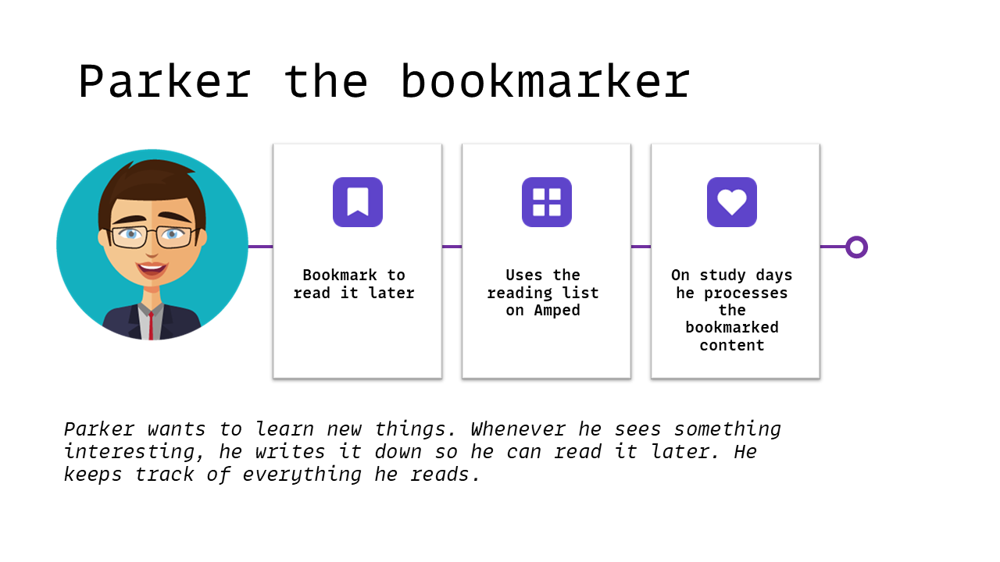

# Break Out dotnet

Ons uitgangspunt is de Bookmarks User Story. Deze kun je hier bekijken: [Bookmarks](../../docs/backlog/1.%20Bookmarks.md).

Je kunt de workshop in zowel .NET 7 uitvoeren, als in .NET 8. Deze laatste is nog in "Preview" (Preview 4 toen we deze handleiding schreven), maar je zou er goed mee aan de slag moeten kunnen. Check je huidige versie met: 

```
dotnet --version
```


## De standaard: .NET 7

Zorg dat je .NET 7 lokaal geinstalleerd hebt. In de meeste gevallen wil je aan de slag met de .NET 7.0 .NET SDK voor x64.  Mocht dat nog niet zo zijn.... volg de instructies hier: https://dotnet.microsoft.com/en-us/download/dotnet 


## Het alternatief: .NET 8

Zorg dat je .NET 8 Preview lokaal geinstalleerd hebt. Kies in de meeste gevallen gewoon voor de .NET SDK voor x64. Volg de instructies hier: https://dotnet.microsoft.com/en-us/download/dotnet/8.0

> Heb je .NET 8 Preview geinstalleerd, maar wil je toch een .NET 7 project maken? Dat kan...gebruik hier voor een "global.json" file.
>
> Meer info: https://learn.microsoft.com/en-us/dotnet/core/versions/selection


## Het project

In de ADR (Architectural Decision Record) staat wat informatie over het type API dat we kunnen gebruiken. Een ADR is eigenlijk de geschreven motivatie achter een (software)-architecturele keuze die je als team (zelfstandig of samen met een Software Architect) maakt. Het zorgt er voor, dat je op een later moment nog kunt "terughalen" onder welke omstandigheden (en met welke kennis) een beslissing genomen is. 

Bekijk de ADR voor de [Minimal API](../../docs/ADR/1.%20Minimal%20API.md).

Een minimal API is snel gemaakt. Gebruik hiervoor bijvoorbeeld de commandline (Rider en Visual Studio hebben ook een GUI hier voor, mocht je dat liever gebruiken).

```
dotnet new web -o amped-bookmark
```

Wat je previes aan projectbestanden krijgt hangt een beetje van de .NET SDK versie af. In ieder geval een Program.cs en daar gaat het meeste in moeten gebeuren. 

Naast het maken van een project moet je even de developer certificaten installeren mocht je dat nog niet gedaan hebben. 

```
dotnet dev-certs https --trust
```

## De User Story

Dit is een goed moment om samen even naar de User Story te kijken. Misschien zelfs even een korte refinement te plannen en een aanvalsplan te maken. 

[Bookmarks](../../docs/backlog/1.%20Bookmarks.md)

Het persona wat hier bij hoort:




## De techniek

Op basis van de refinement kunnen we aan de slag. Wij kozen voor de volgende componenten, maar uiteraard is die keuze helemaal aan jullie!

```
dotnet add package Microsoft.EntityFrameworkCore.InMemory

dotnet add package Microsoft.AspNetCore.Diagnostics.EntityFrameworkCore

dotnet add package dotenv.net

dotnet add package Microsoft.AspNetCore.Authentication.JwtBearer
```

* Een in-memory database. Kan ook met een repository o.i.d., maar in dit geval is een "echte" database wel handig.
* Database en .NET.... dan natuurlijk Entity Framework.
* DotEnv (optioneel) is een handige tool om iets te doen met Environment variabelen. Zien we ook veel in gebruik bij frontend projecten en werkt leuk samen met container platforms. 
* JwtBearer hadden we nodig voor het werken met de API scopes.

## Aan de slag

Uit de User Story wordt duidelijk wat we moeten gaan bouwen. Er komt een punt, dat je de link met onze Identity Provider moet gaan leggen. Gebruik hier voor de gegevens die we apart zullen verstrekken.

Kijk of je de volgende Minimal API features tegenkomt en/of kunt (of zelfs moet) gebruiken:
* MapGroup https://learn.microsoft.com/en-us/aspnet/core/fundamentals/minimal-apis/route-handlers?view=aspnetcore-7.0#route-groups 
* AuthN en AuthZ https://learn.microsoft.com/en-us/aspnet/core/fundamentals/minimal-apis/security
* CreateSlimBuilder i.p.v. de WebApplicationBuilder in .NET 8 https://learn.microsoft.com/en-us/dotnet/api/microsoft.aspnetcore.builder.webapplication.createslimbuilder?view=aspnetcore-8.0

## Tips

### Postman collectie

Er is een Postman collectie met daarin enkele (voor de hand liggende) calls. Deze collectie is ook voorbereid op de Authorization met Auth0. Hier moet je dan wel nog de juiste waarden in de variabelen zetten. Gebruik hiervoor de verstrekte gegevens.

1. Import de Postman collectie. Je vindt deze in ./postman/Kennisdag.postman_collection.json.
2. Update de variabelen van de collectie.


Je kunt daarna Postman gebruiken voor het ophalen van bijvoorbeeld een Access Token (zodat je je API kunt testen).


### Scope vs Role Based claims

ASP.NET werkt uit de doos met Role Based claims. In deze workshop maken we liever gebruik van de (meer algemene) Resource Scope claims. Op zich geen probleem, maar de standaard Authorization Policy Builder heeft daar niet direct de juiste methodes voor. Onze oplossing was een eigen Authorization Requirement toevoegen die de check op scope doet. 

```csharp
builder.Services.AddAuthorization(options =>
{
    options.AddPolicy("write:bookmarks", policy =>
    {
        policy.Requirements.Add(new
            HasScopeRequirement("write:bookmarks", issuer));
    });
});

builder.Services.AddSingleton<IAuthorizationHandler, HasScopeHandler>();
```

```csharp
public class HasScopeRequirement : IAuthorizationRequirement
{
    public string Issuer { get; }
    public string Scope { get; }

    public HasScopeRequirement(string scope, string issuer)
    {
        Scope = scope ?? throw new ArgumentNullException(nameof(scope));
        Issuer = issuer ?? throw new ArgumentNullException(nameof(issuer));
    }
}
```

```csharp
public class HasScopeHandler: AuthorizationHandler<HasScopeRequirement>
{
    protected override Task HandleRequirementAsync(AuthorizationHandlerContext context, HasScopeRequirement requirement)
    {
        // If user does not have the scope claim, get out of here
        if (!context.User.HasClaim(c => c.Type == "scope" && c.Issuer == requirement.Issuer))
            return Task.CompletedTask;

        // Split the scopes string into an array
        var scopes = context.User.FindFirst(c => c.Type == "scope" && c.Issuer == requirement.Issuer)?.Value.Split(' ');

        // Succeed if the scope array contains the required scope
        if (scopes != null && scopes.Any(s => s == requirement.Scope))
            context.Succeed(requirement);

        return Task.CompletedTask;
    }
}
```

### Name Claim

ASP.NET kiest voor een andere URI / Schema voor wat betreft de Name Identifier van een entiteit. OAuth (en daarmee ook OIDC) kiezen voor de subject claim. Dit kun je makkelijk aanpassen tijdens de bootstrap van de AuthN (de NameClaimType validation parameter):

```csharp
builder.Services.AddAuthentication(JwtBearerDefaults.AuthenticationScheme)
    .AddJwtBearer(options =>
    {
        var audience = builder.Configuration.GetValue<string>("AUTH0_AUDIENCE");
        options.Authority = issuer;
        options.Audience = audience;
        options.TokenValidationParameters = new TokenValidationParameters
        {
            ValidateAudience = true,
            ValidateIssuerSigningKey = true,
            NameClaimType = ClaimTypes.NameIdentifier
        };
    });
```