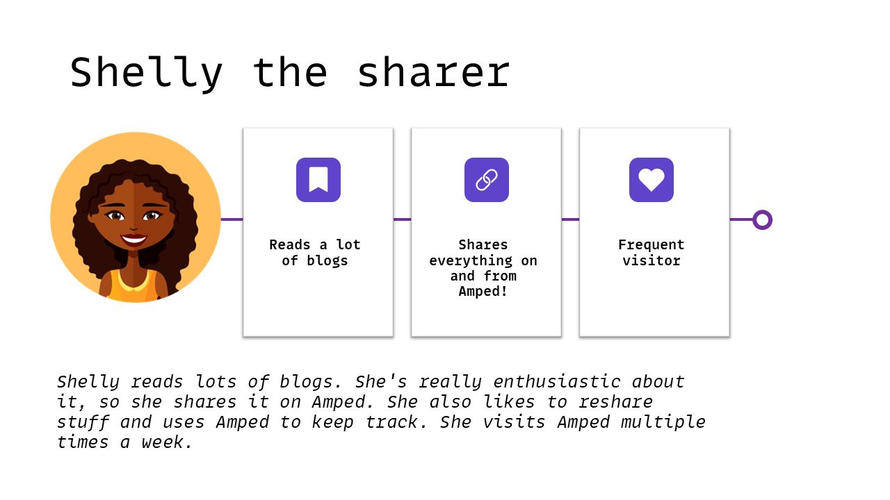

# Break Out Java

Ons uitgangspunt is de Profiles User Story. Deze kun je hier bekijken: [User Profiles](../../docs/backlog/2.%20User%20profiles.md).

We gaan er van uit, dat je de workshop in Quarkus 3 doet, maar het is natuurlijk ook aardig om het met Spring Boot 3 te proberen.

## De standaard: Quarkus 3


## Het alternatief: Spring Boot 3.1


## Het project

In de ADR (Architectural Decision Record) staat wat informatie over het type API dat we kunnen gebruiken. Een ADR is eigenlijk de geschreven motivatie achter een (software)-architecturele keuze die je als team (zelfstandig of samen met een Software Architect) maakt. Het zorgt er voor, dat je op een later moment nog kunt "terughalen" onder welke omstandigheden (en met welke kennis) een beslissing genomen is. 

Bekijk de ADR voor de [AOT met Quarkus](../../docs/ADR/2.%20AOT%20met%20Quarkus.md).

```

```

## De User Story

Dit is een goed moment om samen even naar de User Story te kijken. Misschien zelfs even een korte refinement te plannen en een aanvalsplan te maken. 

[User Profiles](../../docs/backlog/2.%20User%20profiles.md)

Het persona wat hier bij hoort:




## De techniek

Op basis van de refinement kunnen we aan de slag. Wij kozen voor de volgende componenten, maar uiteraard is die keuze helemaal aan jullie!

```

```

* ...
* ...
* ...

## Aan de slag

Uit de User Story wordt duidelijk wat we moeten gaan bouwen. Er komt een punt, dat je de link met onze Identity Provider moet gaan leggen. Gebruik hier voor de gegevens die we apart zullen verstrekken.

Kijk of je de volgende Quarkus features tegenkomt en/of kunt (of zelfs moet) gebruiken:
* ...
* ...
* ...

## Tips

